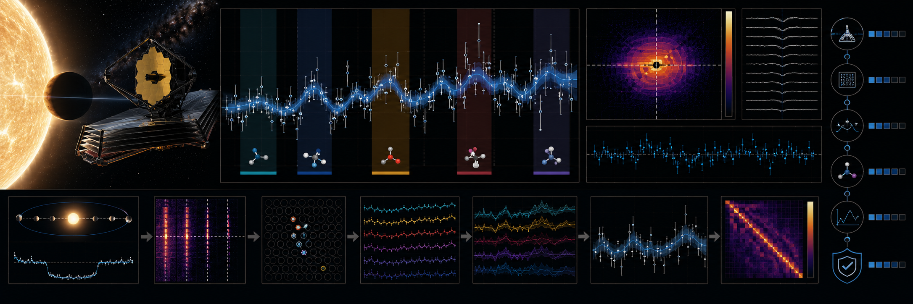

# JWST WASP-39 b Transmission-Spectrum Evidence Ladder



> **Curation:** `BUILD_FIRST` · Priority 8.8/10 · real public JWST spectrum products

## Scientific question

How stable are simple nested-model feature preferences in a real published WASP-39 b transmission spectrum under bootstrap and wavelength-segment sensitivity?

## What this repository contributes

A transparent model-comparison bridge; not a full atmospheric retrieval or replacement for TauREx/petitRADTRANS.

## Key result

Using the real, published WASP-39b transmission spectrum and the paper's own full (with CO) and no-CO nested best-fit models (Grant, Lothringer, Wakeford et al. 2023, Zenodo DOI 10.5281/zenodo.7866690), a weighted chi-square/AIC/BIC evidence ladder strongly prefers the CO model over the full 3.82–5.16 μm spectrum (1008 real wavelength points): ΔAIC = 73.65, ΔBIC = 68.74 — both far above the conventional "strong evidence" threshold of 6, consistent with the paper's own CO detection. A bootstrap 95% confidence interval on the mean residual amplitude in the CO absorption band excludes zero: [1.35, 2.52] × 10⁻⁴ in transit-depth units. In a leave-one-wavelength-segment-out check, 2 of 3 independent segments individually favour the CO model; the one that does not (the low-wavelength third, mostly blueward of the CO band) is consistent with the known physical location of the feature (~4.3–4.6 μm), not a contradiction of the full-spectrum result. The synthetic injection-recovery gate passed in both directions (known feature recovered; null control does not spuriously prefer the complex model).

## Reproducing this result

```bash
python -m venv .venv
# Windows PowerShell
.venv\Scripts\Activate.ps1
python -m pip install -e ".[dev]"
pytest -q
python scripts/run_analysis.py --demo
python scripts/make_figures.py --demo
```

The demo path above uses clearly-labelled synthetic data for a fast smoke test. The real-data result quoted above requires downloading the real archive product first (`python scripts/fetch_data.py --i-have-authorization`), then `python scripts/run_analysis.py` and `python scripts/make_figures.py` without `--demo`.

For the web dashboard:

```bash
cd web-react
npm install
npm run dev
```

## Research documentation

- `CURATION_STATUS.md`
- `docs/RESEARCH_BLUEPRINT.md`
- `docs/DATASET_PLAN.md`
- `docs/LITERATURE_SEEDS.md`
- `docs/VALIDATION_CONTRACT.md`
- `docs/FIGURE_AND_UI_SPEC.md`

## Reproducibility and FAIR practice

All real inputs require product IDs, retrieval times, checksums, source terms and deterministic selection manifests. Derived results record the software commit and configuration hash.

## Limitations

- A transparent model-comparison bridge over the paper's own published models; not a full atmospheric retrieval and not a replacement for TauREx/petitRADTRANS.
- Only one real target (a single reduced-visit spectrum) is available from the 60.3 KB Zenodo product used; a much larger originally-scoped Zenodo deposit (1.74 GB) was rejected as too large for a bounded first release.
- The no-CO → full-model step is treated as adding exactly 1 effective free parameter, a documented simplification rather than the real retrieval's exact parameter count.

## Author

Biswajit Jana

## Licence

BSD-3-Clause for original code. Mission/archive products retain their original terms.
